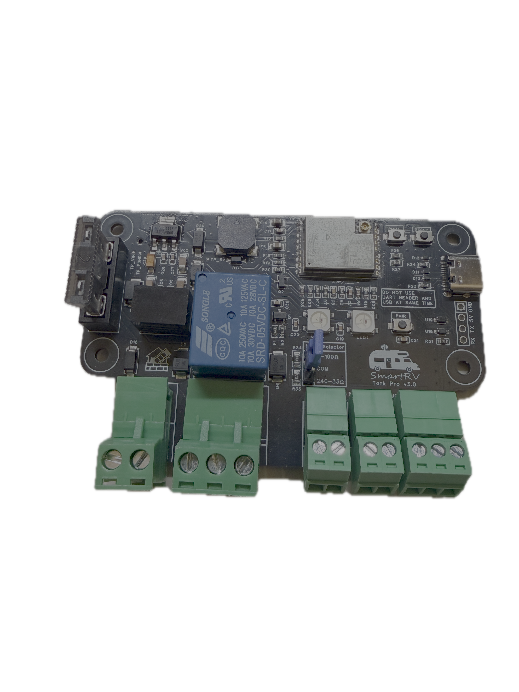

# SmartRV TankPro (v0.2.0)

Open-source tank monitoring/control system for RVs/boats: ESP32-C3 controllers on each tank plus a Cheap Yellow Display (CYD) as the primary node.

## Key features
- Works over Wi‑Fi or Direct (ESP‑NOW) between CYD and controllers.
- Fresh + Waste roles, max two controllers per display.
- Live level/temperature/leak/fault telemetry and relay control (fill/drain).
- On-device safety (fault detection, failsafe valve shutoff on comms loss).
- Factory reset + direct-mode lock for secure pairing.
- ESPHome-based controller firmware; LVGL-based CYD firmware.
- Controller can also run standalone with Home Assistant (ESPHome integration).

## How it works
- Controller reads tank sensors, drives relay/buzzer/LEDs, and reports state.
- CYD discovers controllers, assigns roles, shows status, and sends commands.
- Link can be Wi‑Fi (UDP) on your LAN or Direct ESP‑NOW (channel 6) when no AP.

## Repository map
- `hardware/controller/` – hardware overview + changelog (fabrication files in `hardware/fabrication/`).
- `firmware/src/controller/` – ESPHome controller firmware (README + changelog).
- `firmware/src/display/` – CYD firmware (PlatformIO LVGL) with README + changelog.
- `docs/` – reference guides/assets (see `docs/README.md`).
- `CHANGELOG.md` – project-wide changes.

## Getting started
- Prebuilt binaries (v0.2.0): controller `releases/v0.2.0/controller-v0.2.0-esp32c3-factory.bin`, CYD `releases/v0.2.0/cyd-v0.2.0-*.bin`.
- You can also build from source if you prefer (commands below).
- Hardware: see `hardware/controller/README.md` (parts, wiring, safety).
- Controller firmware: `firmware/src/controller/README.md` (modes, pairing, flashing).
- CYD firmware: `firmware/src/display/README.md` (UI actions, flashing).
- Docs index: `docs/README.md`
- Getting started guide: `docs/getting-started.md`
- Roadmap: `docs/roadmap.md`
- Beta testing: `docs/beta-testing.md`

## Demo videos
- (placeholder links for quick demos)

## Release checklist (quick)
- Build controller: `cd firmware/src/controller/esphome && esphome compile tankpro.yaml`
- Build display: `cd firmware/src/display/CYD && pio run -e cyd`
- Update changelogs: root + subsystem files.
- Place prebuilt binaries under `releases/<version>/` (controller factory + CYD bootloader/partitions/firmware).
- Tag: `git tag -a v0.2.0 -m "SmartRV TankPro v0.2.0"`

## Licensing
- Hardware: CERN OHL-W v2 (`LICENSE-HARDWARE`).
- Software/Firmware: MIT (`LICENSE`).
