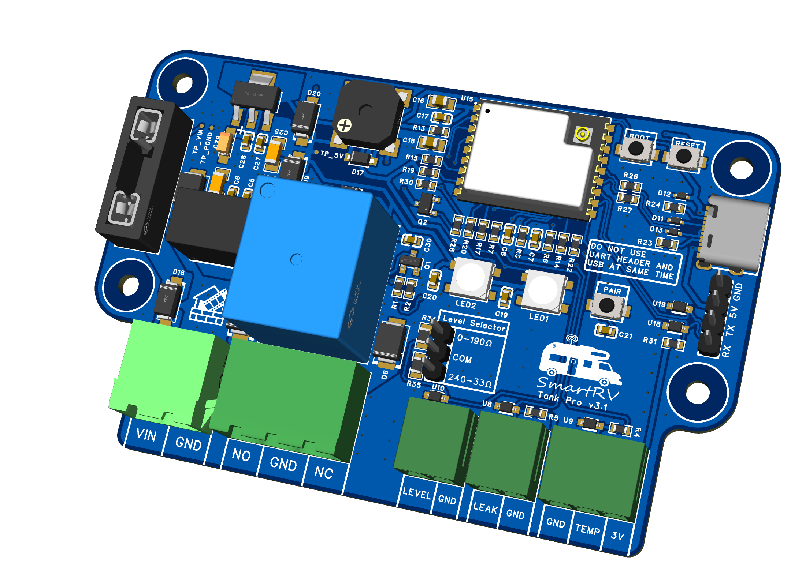
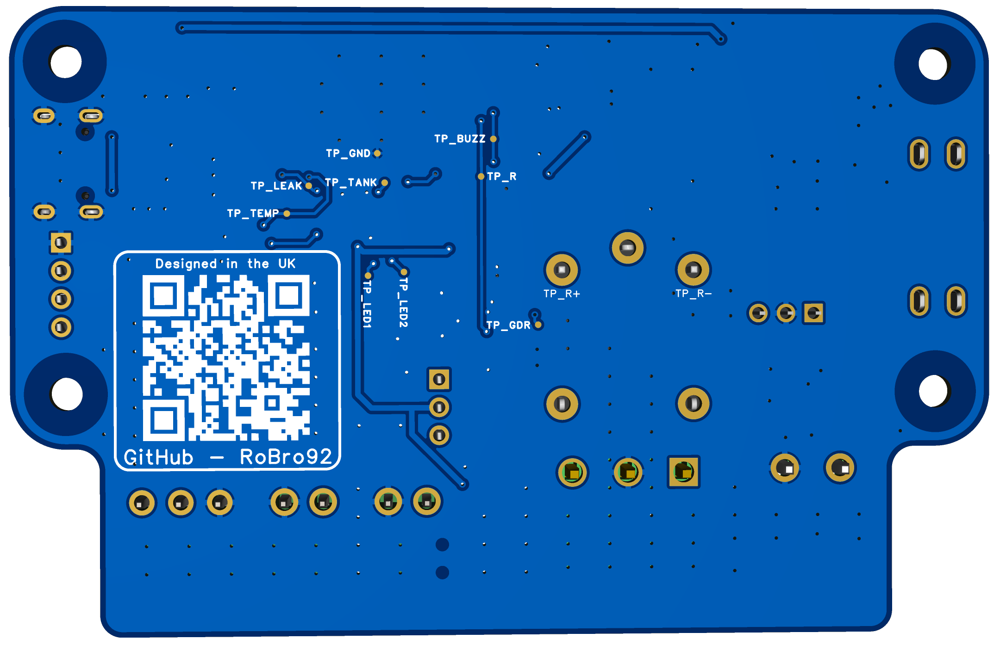

# Hardware

This folder holds the SmartRV TankPro hardware design files. Unless noted otherwise in `legacy/`, the hardware is licensed under CERN OHL-W v2 (see `LICENSE-HARDWARE` at the repo root).

- `mechanical/`: Enclosure and mechanical CAD (STEP/DXF/STL) for panels and models.
- `legacy/`: Archived v1/v2 hardware retained for reference and kept under their original licences noted within.

## PCB renders (rev v3.1)

